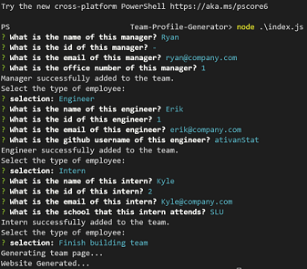

# Team Profile Generator

</p<
 

<h3>Table of Contents</h3>

  <ol>
    <li><a href="#description">Description</a></li>
    <li><a href="#install-instruct">Installation Instructions</a></li>
    <li><a href="#usage">Usage Information</a></li>
    <li><a href="#contribute">Contributors</a></li>
    <li><a href="#tests">Tests</a></li>
    <li><a href="#license">License</a></li>
    <li><a href="#questions">Questions</a></li>
  </ol>

<h2 id='description'>Description</h2>

This program will allow the user to build an html file that will display their team members. This program will instruct the user to input the manager,
the enginerrs, and interns for the team. Each member will have their name, role, employee id, and email attached to their respective card. The manager will have their office number
associated with their card. The engineers will have their github profile associated with their card. The interns will have their school associated with their card.
 

<h2 id='install-instruct'>Installation Instructions</h2>

1. Clone the repo from `git@github.com:ParagasR/Team-profile-Generator.git`
2. Run `npm i` to install dependancies
3. Open the terminal in the associated folder
4. Run node index.js 
 

<h2 id='demonstration'>Demonstration</h2>

<a href='https://drive.google.com/file/d/1jEsCwhaboDE0tAxdroQ-DxPg28wl_954/view?usp=sharing'>Link to Video</a>
 

<h2 id='demonstration'>Screenshots</h2>

 

<h2 id='usage'>Usage Information</h2>

Once the HTML file has been generated, it will be located in the `dist` folder. Right click on the `index.html` and open in browser.
 

<h2 id='contribute'>Contributors</h2>

If you would like to contribute to this project, fork it and then submit a pull request. If there are any issues/suggestions, please submit a 
an issues ticket.
 

<h2 id='tests'>Tests</h2>

This application uses Jest to run it's test. 
Run `npm run test` to start the test files.
 

<h2 id='license'>License</h2>
All rights granted under this License are granted for the term of copyright on the Program, and are irrevocable provided the stated conditions are met. This License explicitly affirms your unlimited permission to run the unmodified Program. The output from running a covered work is covered by this License only if the output, given its content, constitutes a covered work. This License acknowledges your rights of fair use or other equivalent, as provided by copyright law.  

You may make, run and propagate covered works that you do not convey, without conditions so long as your license otherwise remains in force. You may convey covered works to others for the sole purpose of having them make modifications exclusively for you, or provide you with facilities for running those works, provided that you comply with the terms of this License in conveying all material for which you do not control copyright. Those thus making or running the covered works for you must do so exclusively on your behalf, under your direction and control, on terms that prohibit them from making any copies of your copyrighted material outside their relationship with you.

To read more about this license, please follow this [link](https://www.gnu.org/licenses/gpl-3.0). 
 

<h2 id='questions'>Questions</h2>

If you have any questions or issues, please email me at r.paragas@outlook.com.

For any further information, here is my [github page](https://github.com/ParagasR).
